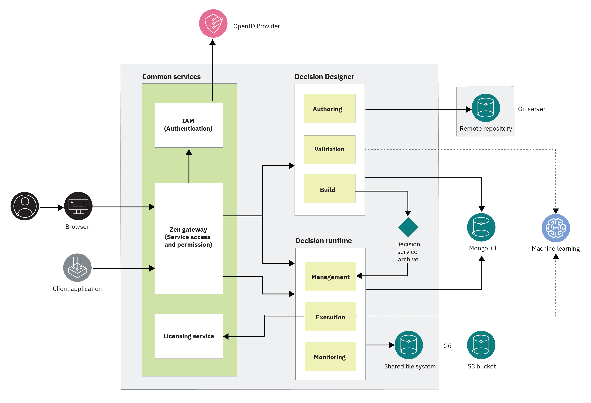

# Installing Automation Decision Services on Kubernetes

You can install Automation Decision Services on different Kubernetes distributions. 

You must use Operator Lifecycle Manager (OLM) to install the Automation Decision Services operator along with its Cloud Pak foundational services and Cloud Pak Platform UI (Zen) dependencies. 

Automation Decision Services uses the foundational services for licensing and authentication, and Zen for routing and authorization.

> Note: You can find complementary instructions specific to Amazon Elastic Kubernetes Service (EKS) in [the corresponding folder](eks/README.md) in this repository.




## Step 1: Prerequisites 
With the following instructions, you can install Automation Services on the following Kubernetes clusters:
- OpenShift Container Platform (OCP)
- Amazon Elastic Kubernetes Service (EKS)

Before you install Automation Decision Services, you need to check your environment to make sure that you have everything you need.

### 1-a: Cluster
You need to have a Kubernetes cluster to install Automation Decision Services.  
For information about supported versions, see [System requirements](https://www.ibm.com/docs/en/ads/22.0.2?topic=planning-system-requirements).

> Note: You can find complementary instructions specific to [EKS](eks/README.md) in the current repository.   

You must use `kubectl` command with a version supported by your cluster.

### 1-b: Domain name
You must control a DNS domain name (for example: `subdomain.my-company.com`), so that you can create DNS aliases (for example:   
`cp-console.subdomain.my-company.com` and `cpd-ads.subdomain.my-company.com`), and they can be resolved to your cluster IP.

### 1-c: Operator Lifecycle Manager
> Note: If you are using OCP, you do not need to install OLM as it is installed with OCP.

To install [OLM](https://github.com/operator-framework/operator-lifecycle-manager), follow the [instructions](https://github.com/operator-framework/operator-lifecycle-manager/releases) on the release note. 

While following the instructions, you need to run a command as shown in the following example:
```shell
curl -L https://github.com/operator-framework/operator-lifecycle-manager/releases/download/v0.23.1/install.sh -o install.sh
chmod +x install.sh
./install.sh v0.23.1
```

OLM is now considered to be installed in the `olm` namespace in the following steps.

## Step 2: Pre-installation tasks
Pre-installation tasks of Automation Decision Services involve the following steps:
- 2-a: Get an IBM entitlement API key
- 2-b: Use storage classes
- 2-c: Install the foundational services

### 2-a: Getting an IBM entitlement API key
You must have your IBM entitlement API key to access images in the IBM Entitled Registry.

To obtain the IBM entitlement API key that is associated with your My IBM account:
1. Log in to [Container software library](https://myibm.ibm.com/products-services/containerlibrary) on My IBM with the IBM ID and password that are associated with the entitled software.
2. On the **Get entitlement key** tab, select **Copy key** to copy the entitlement key to the clipboard.


You need this key to create a Docker pull secret named `ibm-entitlement-key` into the namespace where you install Automation Decision Services, so that images can be pulled from the entitled registry.   
You can create it by using the following command:
```shell
kubectl create secret docker-registry ibm-entitlement-key \
                      --namespace <ads-namespace> \
                      --docker-server=cp.icr.io \
                      --docker-username=cp \
                      --docker-password=<entitlement-key>
```

### 2-b: Using storage classes
The foundational services use the cluster default storage class that is expected to be a block storage class.
  
Zen needs both a block storage class and a file storage class. For more information about these classes, see [Storage options](https://www.ibm.com/docs/en/cpfs?topic=operator-storage-options).
  
The decision runtime needs an RWX storage class, or its persistence layer can be configured to use an S3 API compatible storage. 
  
The storage class for MongoDB and the decision runtime that is specific to EKS is available in [this repository](eks#storage-class).

> Note: The embedded MongoDB is not recommended for production use.
>
> If you use the embedded MongoDB, use a block storage class for the MongoDB storage unless it is bound to a node, because the MongoDB pod that uses the persistent volume (PV) can restart another node. If you don't have a block storage class that meets this requirement, use an RWX storage class instead.

### 2-c: Installing the foundational services  
Before you start installing Automation Decision Services, you must choose in which namespace you install Automation Decision Services. You must also decide 
where you install the foundational services (also known as common services). 
  
> Note: Although it is possible to install the common services in the following ways, it is not recommended:
> - to install the common services in a namespace other than the one for Automation Decision Services
> - to install the common services in its default `ibm-common-services` namespace
  
The Zen UI is installed in the same namespace as the Automation Decision Services instance. You can only have one Automation Decision Services custom resource (CR) for each namespace. Therefore, you have a one-to-one mapping between the Zen UI and the Automation Decision Service instance.

Install a configuration map to indicate where to install common services. For more information, see the [foundational services documentation](https://www.ibm.com/docs/en/cpfs?topic=i3o-installing-cloud-pak-foundational-services-in-multiple-namespaces).

> Note: Do not create these configuration maps manually if you use the script that is provided in Step 3: Installing Automation Decision Services.

In the following example, you install the common services in the same `ads` namespace as Automation Decision Services. The `cs-control` namespace is created, and  it contains the licensing operator and pods.

```yaml
apiVersion: v1
kind: ConfigMap
metadata:
  name: common-service-maps
  namespace: kube-public
data: 
  common-service-maps.yaml: |
    controlNamespace: cs-control
    namespaceMapping:
    - requested-from-namespace:
      # The namespace where you install the common-services
      - ads
      #  The namespace where you will install your ADS instance
      map-to-common-service-namespace: ads
```

Create a `ibm-cpp-config` configuration map in the common services namespace (in this example: `ads`)
```yaml
apiVersion: v1
kind: ConfigMap
metadata:
  name: ibm-cpp-config
  namespace: ads
data:
  commonwebui.standalone: "true"
  kubernetes_cluster_type: cncf           # Not for openshift
  domain_name: subdomain.my-company.com   # Not for openshift

```

## Step 3: Installing Automation Decision Services
Installing Automation Decision Services involves the following steps:
- 3-a: Create OLM resources (catalog sources, operator group, and subscription)
- 3-b: Create and configure secrets for Automation Decision Services
- 3-c: Apply the custom resource (CR) for Automation Decision Services.

You can either follow this procedure manually, or use a provided script by running the following command:

For OCP:
```shell
./scripts/ads-install.sh -n ads
```

For EKS:
```shell
./scripts/ads-install.sh -n ads -d subdomain.my-company.com
```

- `ads` is the namespace where Automation Decision Services is installed.
- `subdomain.my-company.com` is the routable domain suffix that is used to create Ingresses.
- Do not use the `-d` switch if you are using OpenShift.

When you reach the end of the script, you can skip the rest of this section, and go directly to the [Creating secrets](#creating-secrets) section to create secrets for Automation Decision Services.

### 3-a: Creating Operator Lifecycle Manager resources
You create the OLM resources in the following order: 
1. Catalog sources
2. Operator group
3. Subscription
  
#### Catalog sources
Add a catalog source for foundational services:
```yaml
# IBM Cloud Foundational Services 3.23.1
apiVersion: operators.coreos.com/v1alpha1
kind: CatalogSource
metadata:
  name: opencloud-operators
  namespace: olm                                          # openshift-marketplace for openshift
  annotations:
    bedrock_catalogsource_priority: '1'
spec:
  displayName: IBMCS Operators
  publisher: IBM
  sourceType: grpc
  grpcPodConfig:                                           # Not for openshift
    securityContextConfig: restricted                      # Not for openshift
  image: icr.io/cpopen/ibm-common-service-catalog@sha256:95ed8b2bd8e2e77f863557d27e591ea15dd667159d9c52059492533c6ba0f270  # CS 3.23.1
  updateStrategy:
    registryPoll:
      interval: 45m
  priority: 100
```

Add a catalog source for Automation Decision Services:
```yaml
apiVersion: operators.coreos.com/v1alpha1
kind: CatalogSource
metadata:
  name: ibm-ads-operator-catalog
  namespace: olm                           # openshift-marketplace for openshift
spec:
  displayName: ibm-ads-operator
  image: icr.io/cpopen/ibm-ads-operator-catalog@sha256:4ec6663aea3914da5c4aa5814bcfef8de6a85aabafeea0fe35c99bad20e860e7  # 22.0.2-IF003
  publisher: IBM
  sourceType: grpc
  grpcPodConfig:                            # Not for openshift
    securityContextConfig: restricted       # Not for openshift 
  updateStrategy:
    registryPoll:
      interval: 45m
```

#### Operator group
Create an operator group to install the Automation Decision Services operator and dependencies:
```yaml
apiVersion: operators.coreos.com/v1
kind: OperatorGroup
metadata:
  name: ibm-ads-operator-group
  namespace: ads
spec:
  targetNamespaces:
  - ads
```

#### Subscription
Create a subscription to install the Automation Decision Services operator and dependencies:
```yaml
apiVersion: operators.coreos.com/v1alpha1
kind: Subscription
metadata:
  name: ibm-ads-v22.2
  namespace: ads
spec:
  channel: v22.2
  installPlanApproval: Automatic
  name: ibm-ads-kn-operator
  source: ibm-ads-operator-catalog
  sourceNamespace: olm                 # openshift-marketplace for openshift
```
This installs the Automation Decision Services and foundational services base operators into the `ads` namespace.

### 3-b. Creating secrets
By default, secrets are automatically created for you if you do not provide them for the Decision Designer admin, the decision runtime admin, and MongoDB. 

#### Decision Designer admin secret
Check [Configuring Decision Designer](https://www.ibm.com/docs/en/ads/22.0.2?topic=preparing-configuring-decision-designer) in the product documentation to learn how to configure the Decision Designer secrets.

#### Decision runtime admin secret
Check [Configuring the decision runtime](https://www.ibm.com/docs/en/ads/22.0.2?topic=preparing-configuring-decision-runtime) in the product documentation to learn how to configure the decision runtime secrets.
 
#### MongoDB secret
The secret is generated for you when you use the embedded MongoDB (it is not recommended for production use). Otherwise, you must provide the MongoDB URIs for your remote MongoDB instance, and you might need to add the certificate presented by your MongoDB to the Automation Decision Service certificate trusted list.

Check [Configuring MongoDB storage](https://www.ibm.com/docs/en/ads/22.0.2?topic=preparing-configuring-mongodb-storage) in the product documentation to learn how to configure the MongoDB secrets.

### 3-c. Applying the custom resource for Automation Decision Services
What you apply in the CR for Automation Decision Services depends on your target Kubernetes cluster. You apply certain choices available in the storage classes.
  
Check the following samples for minimal CR:

> Note: For more information about configuring the CR, for example, if you want to do more customization on the CR, see [Checking and completing your custom resource](https://www.ibm.com/docs/en/ads/22.0.2?topic=services-checking-completing-your-custom-resource).

#### Amazon Elastic Kubernetes Service (EKS)
Review the instructions specific to EKS in the [readme](eks/README.md).   
> Note: Pay special attention to `efs-for-ads` storage class definition.

```yaml
apiVersion: ads.ibm.com/v1
kind: AutomationDecisionService
metadata:
  name: ads-standalone
  namespace: ads
spec:
    license:
      accept: true
    version: "22.0.2"
        
    # Uncomment following line if you want to use a common services instance in a different namespace than ads.
    # common_services_namespace: ibm-common-services 
    zen:
      file_storage_classname: efs-sc # Has to be RWX
      block_storage_classname: gp2  

    decision_designer:
        enabled: true

    decision_runtime:
        enabled: true
        
        # Uncomment section to use s3 as storage type
        # archive_storage_type: "s3"      # Optional, only used if archive_storage_type is "s3"
        # s3:
            # Following parameters must be set if archive_storage_type is "s3"
            # bucket_name: "ads-dev-eks-runtime"
            # region: "eu-west-3"
            # storage_region: "eu-west-3"
            # server_url: "https://s3.eu-west-3.amazonaws.com"
            # secret_name: s3-secret
            # deployment_space_deletion_delay: 0
            # Optional
            # connection_timeout: 60000 # default value 0 meaning infinite
            # request_timeout: 60000     # default value 0 meaning infinite

        # OR
        #
        # Uncomment to use another storage class then default one. RWX class is needed
        decision_runtime_service:
          persistence:
            storage_class_name: efs-for-ads


    mongo:
        use_embedded: true # Not for production use
        run_as_user: 50001 
        persistence:
           # Uncomment to use another storage class then default one. RWO class is enough provided it is not bound to
           # a node. Use RWX storage class otherwise.
          storage_class_name: efs-for-ads
```

#### OpenShift Container Platform (OCP)

```yaml
apiVersion: ads.ibm.com/v1
kind: AutomationDecisionService
metadata:
  name: ads-standalone
  namespace: ads
spec:
    license:
      accept: true
    version: "22.0.2"
        
    # Uncomment following line if you want to use a common services instance in a different namespace than ads.
    # common_services_namespace: ibm-common-services 
    zen:
      file_storage_classname: ocs-storagecluster-cephfs       # Has to be RWX
      block_storage_classname: ocs-storagecluster-ceph-rbd

    decision_designer:
        enabled: true

    decision_runtime:
        enabled: true
        
        # Uncomment section to use s3 as storage type
        # archive_storage_type: "s3"      # Optional, only used if archive_storage_type is "s3"
        # s3:
            # Following parameters must be set if archive_storage_type is "s3"
            # bucket_name: "ads-dev-eks-runtime"
            # region: "eu-west-3"
            # storage_region: "eu-west-3"
            # server_url: "https://s3.eu-west-3.amazonaws.com"
            # secret_name: s3-secret
            # deployment_space_deletion_delay: 0
            # Optional
            # connection_timeout: 60000 # default value 0 meaning infinite
            # request_timeout: 60000     # default value 0 meaning infinite

        # OR
        #
        # Uncomment to use another storage class then default one. RWX class is needed
        decision_runtime_service:
          persistence:
            storage_class_name: ocs-storagecluster-cephfs

    mongo:
        use_embedded: true # Not for production use
        persistence:
           # Uncomment to use another storage class then default one. RWO class is enough provided it is not bound to
           # a node. Use RWX storage class otherwise.
          storage_class_name: ocs-storagecluster-ceph-rbd
```

When you finish applying your CR, you can view the progress of the installation by checking your CR status. 
For example, you can run the following command:
```shell
kubectl get ads ads-standalone -n ads -o yaml -o go-template='{{range .status.conditions}}CONDITION: {{.type}}{{"\n"}}  STATUS: {{.status}}{{"\n"}}  MESSAGE: {{.message}}{{"\n"}}{{end}}'
CONDITION: Running
  STATUS: False
  MESSAGE: 
CONDITION: Ready
  STATUS: True
  MESSAGE: 
CONDITION: MongoInstalled
  STATUS: True
  MESSAGE: 
CONDITION: DesignerInstalled
  STATUS: True
  MESSAGE: 
CONDITION: RuntimeInstalled
  STATUS: True
  MESSAGE: 
```

> Note: Running indicates whether the Automation Decision Services operator is reconciling. Its status is True if it is processing a CR change, or it was fired by a Kubernetes event it watches (like a secret modification). False is expected when no reconciliation is ongoing.

You might have some expected transient errors (unknown type errors) reported in the status while the foundational services operators and custom resource definitions (CRD) are pulled and started. Then, `ZenService` starts and the Automation Decision Services status reports its progress.   
  
When all the underlying layers are ready, Decision Designer and the decision runtime are installed (you can choose to install one of them or both). The Automation Decision Service status is set to ready when all Automation Decision Services components have at least one pod ready.  
  
It can take about 30 minutes for the first start before it's ready.

When you run the following command, you can wait until the Automation Decision Services installation status becomes ready:
```shell 
kubectl wait ads ads-standalone -n ads --for=condition=Ready=True --timeout=30m
```
For more information about the CR status, see [Custom resource statuses](https://www.ibm.com/docs/en/ads/22.0.2?topic=resource-custom-statuses) in the product documentation.

## Step 4: Post-installation tasks
After you install Automation Decision Services, you need to take additional steps:
- 4-a: Create Kubernetes Ingress
- 4-b: Configure an identity provider
- 4-c: Assign user roles in the Zen console
- 4-d: Tune the logging level

The Automation Decision Services application runs after the CR is applied. However, it is still not reachable from the outside of your cluster.
  
You must create Ingresses and configure Identify and Access Management (IAM) against your identity provider so that you can log in to the Automation Decision Services homepage.
  
For steps 4-c and 4-d, check [Completing post-installation tasks](https://www.ibm.com/docs/en/ads/22.0.2?topic=installing-completing-post-installation-tasks) in the product documentation.

### 4-a: Creating Kubernetes Ingress
You must create three Ingresses. You do not need to create them if you are using OpenShift as routes are created automatically for you.

Ingresses are very dependent on the your Kubernetes flavor and the available Ingress driver. Review the EKS [ingress](./eks/ingress.yaml) descriptors in case you use Amazon Web Services (AWS) Load Balancer Controller.

The following examples are for NGINX Controller.

#### Foundational services console

```yaml
apiVersion: networking.k8s.io/v1
kind: Ingress
metadata:
  # The name of the ingress instance
  name: mgmt-ingress
  namespace: ads
  annotations:
    # The supported ingress class is nginx
    kubernetes.io/ingress.class: nginx
    # Keep the follow three annotations. They are required to work with Common Services front-door.
    nginx.ingress.kubernetes.io/backend-protocol: HTTPS
    nginx.ingress.kubernetes.io/force-ssl-redirect: "true"
    nginx.ingress.kubernetes.io/rewrite-target: /
spec:
  tls:
    - hosts:
      # Using this formula to specify the hostname "cp-console".<cluster's domain name>, for example, cp-console.example.com.
      # If you use a custom hostname that does not follow this formula, please specify it in ibm-cpp-config config map.
      - cp-console.subdomain.my-company.com
      # The name of the secret that contains the TLS certificate and key. 
      secretName: route-tls-secret
  rules:
  # The host must match one specified in spec.tls.hosts.
  - host: cp-console.subdomain.my-company.com
    http:
      paths:
      # Keep the default values for the backend service. It specifies the Common Services front-door service name and port number.
      - backend:
          service:
            name: icp-management-ingress
            port:
              number: 443
        path: /
        pathType: ImplementationSpecific

```

#### Zen console

```yaml
apiVersion: networking.k8s.io/v1
kind: Ingress
metadata:
  annotations:
    kubernetes.io/ingress.class: nginx
    nginx.ingress.kubernetes.io/backend-protocol: HTTPS
    nginx.ingress.kubernetes.io/force-ssl-redirect: "true"
    nginx.ingress.kubernetes.io/rewrite-target: /
  name: zen-ingress
  namespace: ads
spec:
  rules:
  - host: ads-cpd.subdomain.my-company.com
    http:
      paths:
      - backend:
          service:
            name: ibm-nginx-svc
            port:
              number: 443
        path: /
        pathType: ImplementationSpecific
```

#### Licensing console

```yaml
apiVersion: networking.k8s.io/v1
kind: Ingress
metadata:
  name: ibm-licensing-service-instance
  namespace: cs-control
  annotations:
    kubernetes.io/ingress.class: nginx
    nginx.ingress.kubernetes.io/backend-protocol: HTTPS
    nginx.ingress.kubernetes.io/force-ssl-redirect: "true"
    nginx.ingress.kubernetes.io/rewrite-target: /
spec:
  rules:
  - host: licensing.subdomain.my-company.com
    http:
      paths:
      - backend:
          service:
            name: ibm-licensing-service-instance
            port:
              number: 8080
        path: /
        pathType: ImplementationSpecific
```

### 4-b: Configuring an identity provider
By default, an admin user is created for `mgmt-ingress` with its details in the `platform-auth-idp-credentials` secret.
        
Use the following commands to get credentials:
```shell
kubectl get secret platform-auth-idp-credentials -n ads -o jsonpath='{.data.admin_username}' | base64 --decode
kubectl get secret platform-auth-idp-credentials -n ads -o jsonpath='{.data.admin_password}' | base64 --decode
```

For more information, see [IAM for your product platform users](https://www.ibm.com/docs/en/cloud-paks/1.0?topic=guide-iam-your-product-platform-users) in the  foundational services documentation.

### 4-c: Assigning user roles and permissions in the Zen console
No user has any user permission by default. You must assign a user role that contains appropriate user permissions to each user.
        
Check [Managing user permissions](https://www.ibm.com/docs/en/ads/22.0.2?topic=tasks-managing-user-permissions) in the product documentation to learn how to assign user roles to your users.

You can log in to the Zen UI at https://ads-cpd.<subdomain.my-company>.com 
        
### 4-d: Tunning the logging level
Check [Tuning the logging level](https://www.ibm.com/docs/en/ads/22.0.2?topic=tasks-tuning-logging-level) in the product documentation to learn how to fine-tune the logging level.

## Metering
You can query the metering data at any time by navigating to:
`https://licensing.subdomain.my-company.com/products?token=<token>`  
where token is from the `ibm-licensing-token` secret in the `cs-control` namespace.


## Troubleshooting

### Installing the script

```bash
 ./scripts/ads-install.sh -a -n ads -d subdomain.my-company.com
# Checking prereqs ...
[✔] kubectl command available
[✔] OLM available under namespace olm
# Creating common services config maps ...
[✘] common-service-maps already exists in kube-public namespace: it's not a fresh install, please review the documentation troubleshooting section.
```
You have already installed the common services in this cluster.   
                                                                         
Review the `common-service-maps` configuration map in the `kube-public` namespace. 
                                                                         
You must add a `requested-from-namespace` entry in the `namespaceMapping` section, as shown in the following example:
```yaml
    - requested-from-namespace:
      # The namespace where you install the common-services
      - ads
      #  The namespace where you will install your ADS instance
      map-to-common-service-namespace: ads
```
When it's done, you can relaunch the installation script with the `-i` command line switch (ignore) to preserve the configuration map you just edited. 
        
If you want to override the current configuration map with what is needed for the current installation, use the `-f` (force) command line switch. 
> Note: This action might break any other Automation Decision Services or CloudPak install in the same cluster.

## Uninstalling Automation Decision Services

Check [Uninstalling Automation Decision Services](https://www.ibm.com/docs/en/ads/22.0.2?topic=installing-uninstalling) in the product documentation to learn how to uninstall Automation Decision Services.
        

