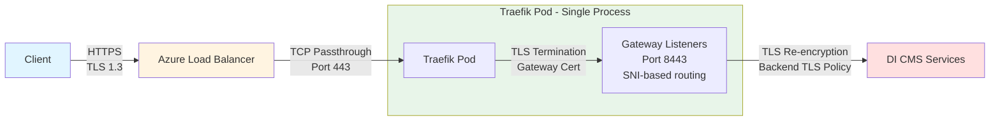

# AKS specific resources

This directory contains resources specific to Azure Kubernetes Service (AKS).

## Namespace Conventions

Throughout this documentation, `<namespace>` is used to refer to different Kubernetes namespaces depending on the context. For clarity, we use the following conventions:

- **DI CMS (ADS) namespace**: `di` - The namespace where IBM Decision Intelligence (Automation Decision Services) is installed
- **Traefik namespace**: `traefik` - The namespace where Traefik Gateway API controller is installed
- **IBM Licensing namespace**: `ibm-licensing` - The namespace where IBM Licensing service is deployed

When you see `<namespace>` in commands, replace it with the appropriate namespace based on the context. The examples below will indicate which namespace is being referenced.

## Cluster Setup

Create an AKS cluster with the following specifications:

```bash
az aks create \
  --resource-group <resource-group-name> \
  --name di-cluster \
  --node-count 4 \
  --enable-cluster-autoscaler \
  --min-count 3 \
  --max-count 6 \
  --generate-ssh-keys 
```

### Configure kubectl

Configure kubectl to connect to your AKS cluster:

```bash
az aks get-credentials --resource-group <resource-group-name> --name di-cluster
```

## Certificate Management

You need an x509 certificate with a distinguished name that matches your `*.subdomain.my-company.com` domain, which will be presented by your Azure Load Balancer.

You can generate a self-signed certificate for testing purposes:

```bash
openssl req -x509 -nodes -days 1000 -newkey rsa:2048 \
  -keyout subdomain.key -out subdomain.crt \
  -subj "/CN=*.subdomain.my-company.com/OU=it/O=<your-org>/L=<your-location>/C=<your-country>"
```

For production environments, obtain a certificate from a trusted Certificate Authority (CA) or use Azure Key Vault to manage your certificates.

Then, create a wildcard DNS entry in your domain that corresponds to the domain you will use for the installation.

If the DNS zone is managed by Azure DNS, create an A record pointing to the Load Balancer's public IP address. For external DNS providers, use a CNAME record pointing to the Load Balancer's DNS name.

## Install IBM Decision Intelligence

Install DICMS using the provided installation scripts:

```bash
cd scripts
./di-install-prereqs.sh -a
./di-install.sh -n di -d subdomain.my-company.com -a
```

Edit the namespace in the DI CMS (ADS) Custom Resource file to match your target namespace (e.g., `di`), then apply it to deploy the instance:

```bash
kubectl apply -f descriptors/DI-minimal-AKS-CR.yaml
```

Wait for the installation to complete:

```bash
kubectl wait --for=condition=Ready AutomationDecisionService/<instance-name> -n di --timeout=30m
```

## Ingress with nginx Controller (Legacy)

> **Note**: The nginx Ingress Controller project is [retiring and will no longer be maintained](https://kubernetes.io/blog/2025/11/11/ingress-nginx-retirement/). We strongly recommend using the Gateway API (see section below) for new deployments. This section is provided for backward compatibility only.

Use [nginx Ingress Controller](https://kubernetes.github.io/ingress-nginx/) to serve DI CMS ingresses with URL rewriting support.

You can follow the basic installation [instructions](https://learn.microsoft.com/en-us/troubleshoot/azure/azure-kubernetes/load-bal-ingress-c/create-unmanaged-ingress-controller?tabs=azure-cli#basic-configuration).

Then use the [di-generate-ingresses.sh](../scripts/di-generate-ingresses.sh) script with the `-t` option to generate ingress definitions:

```bash
./di-generate-ingresses.sh -n di -t
kubectl apply -f /tmp/tmp.XXXXXXXXX
```

This generates ingresses with TLS termination in nginx pods. By default, certificates are self-signed and generated by cert-manager using the `zen-tls-issuer` Issuer.

Create a wildcard DNS A record for `*.subdomain.my-company.com` pointing to the Load Balancer public IP:

```bash
kubectl get service -n ingress-basic ingress-nginx-controller -o jsonpath='{.status.loadBalancer.ingress[0].ip}'
```

## Gateway API (Recommended)

> **Note**: The [nginx Ingress Controller project is retiring](https://kubernetes.io/blog/2025/11/11/ingress-nginx-retirement/) and will no longer be maintained. We strongly recommend using the Gateway API as the modern, standardized alternative. Gateway API provides better routing capabilities, improved TLS configuration, and is the Kubernetes standard for ingress traffic management. This section provides a setup example using Traefik as one of the Gateway API implementations.

### Architecture

The Gateway API setup provides end-to-end TLS encryption with re-encryption between layers:



**TLS Flow:**
1. **Client → Load Balancer**: HTTPS with TLS 1.3 encryption
2. **Load Balancer → Traefik Pod**: TCP passthrough (TLS traffic remains encrypted)
3. **Traefik Pod (Gateway Listeners)**: TLS termination using Gateway certificate, SNI-based routing to appropriate listener, traffic decrypted for routing decisions
4. **Traefik → Backend Services**: TLS re-encryption using BackendTLSPolicy with CA validation

### Prerequisites

- AKS cluster set up (see Cluster Setup section above)
- Certificate generated (see Certificate management section above)
- DNS configured to point to Load Balancer IP

### Install Gateway API CRDs

Install the Gateway API Custom Resource Definitions:

```bash
kubectl apply -f https://github.com/kubernetes-sigs/gateway-api/releases/download/v1.5.1/standard-install.yaml
```

### Create TLS Secret for Gateway

Create a TLS secret for Gateway listeners. This secret must be created in the **DI CMS namespace** (e.g., `di`):

```bash
kubectl create secret tls di-gateway-tls -n di \
  --cert=/path/to/subdomain.crt --key=/path/to/subdomain.key
```

> **Note**: The TLS secret is created in the DI CMS namespace because the Gateway API resources reference it from there. The `di-generate-api-gateway.sh` script will automatically copy this secret to the licensing namespace if needed.

### Install Traefik with Gateway API Support

Install Traefik using Helm with Gateway API enabled and Azure Load Balancer configuration:

```bash
helm repo add traefik https://traefik.github.io/charts
helm repo update

kubectl create namespace traefik

helm install traefik traefik/traefik -n traefik \
  --set providers.kubernetesGateway.enabled=true \
  --set ports.web.port=8000 \
  --set ports.web.exposedPort=80 \
  --set ports.websecure.port=8443 \
  --set ports.websecure.exposedPort=443 \
  --set service.type=LoadBalancer \
  --set service.annotations."service\.beta\.kubernetes\.io/azure-load-balancer-internal"=false \
```


**Configuration Explanation:**
- `ports.websecure.port=8443`: Traefik container listens on port 8443
- `ports.websecure.exposedPort=443`: LoadBalancer exposes standard HTTPS port 443
- `service.type=LoadBalancer`: Creates an Azure Load Balancer
- `azure-load-balancer-internal=false`: Creates a public-facing Load Balancer

### Create Traefik GatewayClass

```bash
cat <<EOF | kubectl apply -f -
apiVersion: gateway.networking.k8s.io/v1
kind: GatewayClass
metadata:
  name: traefik
spec:
  controllerName: traefik.io/gateway-controller
EOF
```

### Update DNS

Get the Traefik LoadBalancer public IP and update your DNS:

```bash
kubectl get svc traefik -n traefik -o jsonpath='{.status.loadBalancer.ingress[0].ip}'
```

Update your wildcard DNS record (`*.subdomain.my-company.com`) to point to this public IP address.

### Generate and Apply Gateway API Resources

After DI CMS is installed, use the automation script to generate Gateway API resources (using the DI CMS namespace):

```bash
cd scripts
./di-generate-api-gateway.sh -n di -g traefik-gateway -s di-gateway-tls -o gateway-resources.yaml
```

This script will:
1. Check prerequisites (Gateway API CRDs, TLS secret)
2. Copy the TLS secret to the licensing namespace if needed
3. Extract CA certificates from Common Services (Foundational Services) secrets
4. Create ConfigMaps for backend TLS verification:
   - `cs-ca-certificate-cm`: For platform services (auth, identity, common-web-ui)
   - `ibm-nginx-ca-cm`: For ibm-nginx-svc (uses different CA)
   - `ibm-licensing-ca-cert-cm`: For IBM Licensing service (in licensing namespace)
5. Generate Gateway, HTTPRoute, and BackendTLSPolicy resources:
   - Main Gateway in DI CMS namespace for CP Console and CPD
   - Separate Gateway in licensing namespace for IBM Licensing service

> **Note on Certificate Synchronization**: BackendTLSPolicy uses ConfigMaps (not Secrets) to reference CA certificates for backend TLS verification. The script generates appropriate ConfigMaps by extracting CA certificates from the Common Services (Foundational Services) secrets managed by cert-manager. However, **these ConfigMaps will not be automatically kept in sync** if the underlying secrets are rotated or updated by cert-manager.
>
> For production environments requiring automatic certificate synchronization, consider using [trust-manager](https://cert-manager.io/docs/trust/trust-manager/) which can automatically sync CA certificates from Secrets to ConfigMaps across namespaces. trust-manager watches for certificate changes and updates the target ConfigMaps accordingly, ensuring your BackendTLSPolicy always references current CA certificates.

> **Note on IBM Licensing Service**: The IBM Licensing service uses a self-signed certificate. The script automatically handles this by extracting the certificate from the `tls.crt` field (when `ca.crt` is not available) and creating the appropriate ConfigMap in the licensing namespace. A separate Gateway is created in the licensing namespace to properly route traffic to the licensing service with correct namespace isolation.

Apply the generated resources:

```bash
kubectl apply -f gateway-resources.yaml
```

### Verify the Setup

1. **Check Gateway status**:
   ```bash
   kubectl get gateway traefik-gateway -n di
   ```

   Expected output should show `PROGRAMMED` status:
   ```
   NAME              CLASS     ADDRESS           PROGRAMMED   AGE
   traefik-gateway   traefik   <load-balancer-ip>   True         5m
   ```

2. **Check HTTPRoutes**:
   ```bash
   kubectl get httproute -n di
   ```

   All routes should show `ACCEPTED` status.

3. **Check BackendTLSPolicy status**:
   ```bash
   kubectl get backendtlspolicy -n di
   ```

   All policies should show `Accepted` and `ResolvedRefs` conditions as `True`.

4. **Verify TLS encryption**:
   ```bash
   # Test external TLS connection
   openssl s_client -connect <load-balancer-ip>:443 -servername di-cpd.subdomain.my-company.com
   
   # Check Traefik logs for TLS routes
   kubectl logs -n traefik -l app.kubernetes.io/name=traefik | grep -i tls
   ```

5. **Access the application** (assuming DI CMS namespace is `di`):
   - CPD Interface: `https://di-cpd.subdomain.my-company.com`
   - CP Console: `https://cp-console-di.subdomain.my-company.com`
   - Licensing: `https://licensing.subdomain.my-company.com`

