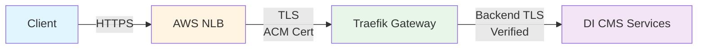

# EKS specific resources

This directory contains resources specific to Amazon Elastic Kubernetes Service (EKS).

## Namespace Conventions

Throughout this documentation, `<namespace>` is used to refer to different Kubernetes namespaces depending on the context. For clarity, we use the following conventions:

- **DI CMS (ADS) namespace**: `di` - The namespace where IBM Decision Intelligence (Automation Decision Services) is installed
- **Traefik namespace**: `traefik` - The namespace where Traefik Gateway API controller is installed
- **IBM Licensing namespace**: `ibm-licensing` - The namespace where IBM Licensing service is deployed

When you see `<namespace>` in commands, replace it with the appropriate namespace based on the context. The examples below will indicate which namespace is being referenced.

## Cluster Setup

Create an EKS cluster with the following specifications:

```bash
eksctl create cluster \
  --name di-cluster \
  --region us-east-1 \
  --nodegroup-name standard-workers \
  --node-type m5.xlarge \
  --nodes 3 \
  --nodes-min 3 \
  --nodes-max 6 \
  --managed
```

### Install EBS CSI Driver

The EBS CSI driver is required for persistent volume support:

1. **Create IAM role for EBS CSI driver**:
   ```bash
   eksctl create iamserviceaccount \
     --name ebs-csi-controller-sa \
     --namespace kube-system \
     --cluster di-cluster \
     --attach-policy-arn arn:aws:iam::aws:policy/service-role/AmazonEBSCSIDriverPolicy \
     --approve \
     --role-only \
     --role-name AmazonEKS_EBS_CSI_DriverRole
   ```

2. **Install the EBS CSI driver addon**:
   ```bash
   eksctl create addon \
     --name aws-ebs-csi-driver \
     --cluster di-cluster \
     --service-account-role-arn arn:aws:iam::<ACCOUNT_ID>:role/AmazonEKS_EBS_CSI_DriverRole \
     --force
   ```

3. **Create GP3 storage class**:
   ```bash
   cat <<EOF | kubectl apply -f -
   apiVersion: storage.k8s.io/v1
   kind: StorageClass
   metadata:
     name: gp3
     annotations:
       storageclass.kubernetes.io/is-default-class: "true"
   provisioner: ebs.csi.aws.com
   volumeBindingMode: WaitForFirstConsumer
   allowVolumeExpansion: true
   parameters:
     type: gp3
     encrypted: "true"
     iops: "3000"
     throughput: "125"
   EOF
   ```

## Certificate management

You have to use a x509 certificate with a distinguished name that matches your `.subdomain.my-company.com` name, which is presented by your Network Load Balancer.  
You can generate an untrusted certificate for testing purpose by using the following command:

```shell
openssl req -x509 -nodes -days 1000 -newkey rsa:2048 -keyout subdomain.key -out subdomain.crt -subj "/CN=*.subdomain.my-company.com/OU=it/O=<your-org>/L=<your-location>/C=<your-country>>"
```

and then, upload it to AWS Certificate Manager by using the following command:

```shell
aws acm import-certificate --certificate fileb:///tmp/subdomain.crt --private-key fileb:///tmp/subdomain.key
```
This command returns the Amazon Resource Name (ARN) of the registered certificate that you can reference in the `service.beta.kubernetes.io/aws-load-balancer-ssl-cert` annotation in following sections.

Then, create a wildcard DNS entry in your domain that corresponds to the domain declared
in the `ibm-cpp-config` ConfigMap and your Ingresses or Gateway.

If the DNS zone is managed by AWS, create an _alias_ A record to the NLB.  (NLB IP addresses change over time. Therefore, a static A record is not applicable and becomes invalid soon).  For DNS zones that are not managed by AWS, a CNAME entry to the NLB automatic hostname is probably usable.

## Install IBM Decision Intelligence

Install DICMS using the provided installation scripts:

```bash
cd scripts
./di-install-prereqs.sh -a
./di-install.sh -n di -d subdomain.my-company.com -a
```

Edit the namespace in the DI CMS (ADS) Custom Resource file to match your target namespace (e.g., `di`), then apply it to deploy the instance:

```bash
kubectl apply -f descriptors/DI-minimal-EKS-CR.yaml
```

Wait for the installation to complete:

```bash
kubectl wait --for=condition=Ready AutomationDecisionService/<instance-name> -n di --timeout=30m
```

## Ingress and Network Load Balancer

> **Note**: The nginx Ingress Controller project is [retiring and will no longer be maintained](https://kubernetes.io/blog/2025/11/11/ingress-nginx-retirement/). We strongly recommend using the Gateway API (see section below) for new deployments. This document provides a setup example using Traefik as the Gateway API implementation.

You must use [nginx Ingress Controller](https://kubernetes.github.io/ingress-nginx/) to serve DI CMS ingresses as url rewriting is needed which is not supported by AWS Ingress Controller.
You should review this AWS [blog](https://aws.amazon.com/blogs/containers/exposing-kubernetes-applications-part-3-nginx-ingress-controller/) that will guide you through nginx Ingress Controller installation used in conjunction with AWS NLB.
For information, you should use nginx Ingress Controller Helm chart with a `values.yaml` file like:
```yaml
controller:
  service:
    type: LoadBalancer
    annotations:
      service.beta.kubernetes.io/aws-load-balancer-name: nginx-ingress
      service.beta.kubernetes.io/aws-load-balancer-type: external
      service.beta.kubernetes.io/aws-load-balancer-scheme: internet-facing
      service.beta.kubernetes.io/aws-load-balancer-nlb-target-type: ip
      service.beta.kubernetes.io/aws-load-balancer-ssl-cert: arn:aws:acm:<region>:XXXXXXXX:certificate/XXXXXX-XXXXXXX-XXXXXXX-XXXXXXXX
      service.beta.kubernetes.io/aws-load-balancer-ssl-ports: https
      service.beta.kubernetes.io/aws-load-balancer-backend-protocol: ssl
```

Then you'll use [di-generate-ingresses.sh](../scripts/di-generate-ingresses.sh) script to obtain the ingresses definition you'll have to apply to your cluster.

## Gateway API (Recommended Alternative)

> **Note**: The [nginx Ingress Controller project is retiring](https://kubernetes.io/blog/2025/11/11/ingress-nginx-retirement/) and will no longer be maintained. We strongly recommend using the Gateway API as the modern, standardized alternative. Gateway API provides better routing capabilities, improved TLS configuration, and is the Kubernetes standard for ingress traffic management. This section provides a setup example using Traefik as one of the Gateway API implementations.

### Architecture

The Gateway API setup provides end-to-end TLS encryption with the following flow:



**TLS Layers:**
1. **External TLS**: Client → NLB (ACM certificate, trusted by browsers)
2. **Internal TLS**: NLB → Traefik (self-signed certificate for backend protocol)
3. **Backend TLS**: Traefik → DI CMS services (verified using CA ConfigMaps)

### Prerequisites

- EKS cluster set up (see Cluster Setup section above)
- Certificate uploaded to ACM (see Certificate management section above)
- DNS configured (see Certificate management section above)

### Install Gateway API CRDs

Install the Gateway API Custom Resource Definitions:

```bash
kubectl apply -f https://github.com/kubernetes-sigs/gateway-api/releases/download/v1.5.1/standard-install.yaml
```

### Create TLS Secret for Gateway

Create a self-signed certificate for internal TLS (between NLB and Traefik). This secret must be created in the **DI CMS namespace** (e.g., `di`):

```bash
openssl req -x509 -nodes -days 365 -newkey rsa:2048 \
  -keyout /tmp/traefik.key -out /tmp/traefik.crt \
  -subj "/CN=*.subdomain.my-company.com/O=MyOrg"

kubectl create secret tls traefik-tls-cert -n di \
  --cert=/tmp/traefik.crt --key=/tmp/traefik.key
```

> **Note**: The TLS secret is created in the DI CMS namespace because the Gateway API resources reference it from there. The `di-generate-api-gateway.sh` script will automatically copy this secret to the licensing namespace if needed.

### Install Traefik with Gateway API Support

Install Traefik using Helm with Gateway API enabled. Traefik can be installed in its own namespace (e.g., `traefik`):

```bash
helm repo add traefik https://traefik.github.io/charts
helm repo update

kubectl create namespace traefik

helm install traefik traefik/traefik -n traefik \
  --set providers.kubernetesGateway.enabled=true \
  --set ports.websecure.port=8443 \
  --set ports.websecure.exposedPort=443 \
  --set service.annotations."service\.beta\.kubernetes\.io/aws-load-balancer-type"=nlb \
  --set service.annotations."service\.beta\.kubernetes\.io/aws-load-balancer-ssl-cert"=<ACM_CERT_ARN> \
  --set service.annotations."service\.beta\.kubernetes\.io/aws-load-balancer-ssl-ports"=443 \
  --set service.annotations."service\.beta\.kubernetes\.io/aws-load-balancer-backend-protocol"=ssl \
  --set additionalArguments[0]="--entrypoints.websecure.http.tls=true"
```

Replace `<ACM_CERT_ARN>` with your ACM certificate ARN from the Certificate management section.

### Create Traefik GatewayClass

```bash
cat <<EOF | kubectl apply -f -
apiVersion: gateway.networking.k8s.io/v1
kind: GatewayClass
metadata:
  name: traefik
spec:
  controllerName: traefik.io/gateway-controller
EOF
```

### Update DNS

Get the Traefik LoadBalancer hostname and update your DNS:

```bash
kubectl get svc traefik -n traefik -o jsonpath='{.status.loadBalancer.ingress[0].hostname}'
```

Update your wildcard DNS record (`*.subdomain.my-company.com`) to point to this NLB hostname.

### Generate and Apply Gateway API Resources

After DI CMS is installed, use the automation script to generate Gateway API resources (using the DI CMS namespace):

```bash
cd scripts
./di-generate-api-gateway.sh -n di -g traefik-gateway -s traefik-tls-cert -o gateway-resources.yaml
```

This script will:
1. Check prerequisites (Gateway API CRDs, TLS secret)
2. Copy the TLS secret to the licensing namespace if needed
3. Extract CA certificates from Common Services (Foundational Services) secrets
4. Create ConfigMaps for backend TLS verification:
   - `cs-ca-certificate-cm`: For platform services (auth, identity, common-web-ui)
   - `ibm-nginx-ca-cm`: For ibm-nginx-svc (uses different CA)
   - `ibm-licensing-ca-cert-cm`: For IBM Licensing service (in licensing namespace)
5. Generate Gateway, HTTPRoute, and BackendTLSPolicy resources:
   - Main Gateway in DI CMS namespace for CP Console and CPD
   - Separate Gateway in licensing namespace for IBM Licensing service

> **Note on Certificate Synchronization**: BackendTLSPolicy uses ConfigMaps (not Secrets) to reference CA certificates for backend TLS verification. The script generates appropriate ConfigMaps by extracting CA certificates from the Common Services (Foundational Services) secrets managed by cert-manager. However, **these ConfigMaps will not be automatically kept in sync** if the underlying secrets are rotated or updated by cert-manager.
>
> For production environments requiring automatic certificate synchronization, consider using [trust-manager](https://cert-manager.io/docs/trust/trust-manager/) which can automatically sync CA certificates from Secrets to ConfigMaps across namespaces. trust-manager watches for certificate changes and updates the target ConfigMaps accordingly, ensuring your BackendTLSPolicy always references current CA certificates.

> **Note on IBM Licensing Service**: The IBM Licensing service uses a self-signed certificate. The script automatically handles this by extracting the certificate from the `tls.crt` field (when `ca.crt` is not available) and creating the appropriate ConfigMap in the licensing namespace. A separate Gateway is created in the licensing namespace to properly route traffic to the licensing service with correct namespace isolation.

Apply the generated resources:
```bash
kubectl apply -f gateway-resources.yaml
```

### Verify the Setup

1. **Check Gateway status**:
   ```bash
   kubectl get gateway traefik-gateway -n di
   ```

2. **Check HTTPRoutes**:
   ```bash
   kubectl get httproute -n di
   ```

3. **Access the application** (assuming DI CMS namespace is `di`):
   - CPD Interface: `https://di-cpd.subdomain.my-company.com`
   - CP Console: `https://cp-console-di.subdomain.my-company.com`
   - Licensing: `https://licensing.subdomain.my-company.com`

## Special network configuration

Depending on how the network was configured, the communication between the kube-api server and worker nodes can be restricted, causing errors during webhook invocations as shown in the following example:
```
I0624 14:19:58.368935       1 waitToCreateCsCR.go:36] Webhook Server not ready, waiting for it to be ready : could not Create resource: Internal error occurred: failed calling webhook \"vcommonservice.kb.io\": failed to call webhook: Post \"https://ibm-common-service-operator-service.di.svc:443/validate-operator-ibm-com-v3-commonservice?timeout=10s\": context deadline exceeded
```
To explicitly allow communications, customize and apply additional custom network [policies](./extended-netpols.yaml) into your cluster to unblock (update the namespace in the policies to match your DI CMS namespace).
